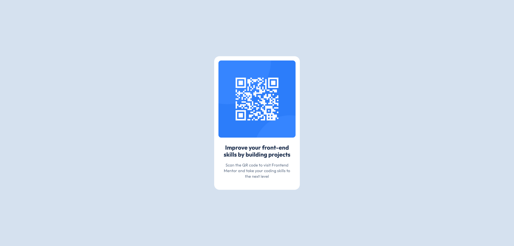

# Frontend Mentor - QR code component solution

This is a solution to the [QR code component challenge on Frontend Mentor](https://www.frontendmentor.io/challenges/qr-code-component-iux_sIO_H). Frontend Mentor challenges help you improve your coding skills by building realistic projects.

## Table of contents

- [Overview](#overview)
  - [Screenshot](#screenshot)
  - [Links](#links)
- [My process](#my-process)
  - [Built with](#built-with)
  - [What I learned](#what-i-learned)
  - [Continued development](#continued-development)
  - [Useful resources](#useful-resources)
- [Author](#author)

## Overview

### Screenshot



### Links

- Solution URL: [Frontend Mentor](https://www.frontendmentor.io/solutions/qr-code-component-using-tailwindcss-Z0wvNp7X1P)
- Live Site URL: [TBD]()

## My process

### Built with

- Semantic HTML5 markup
- Flexbox
- [TailwindCSS][tailwinddocs]
- [Parcel](https://parceljs.org/docs) - for simple static site building

### What I learned

I've always had some sort of struggle centering HTML elements. In previous projects of mine, I usually do this (in terms of Tailwind):

```html
<body class="h-screen">
  <!-- Compiles as `height: 100vh` -->
  <main class="flex h-full items-center justify-center">
    <!-- Compiles as
      {
        display: flex;
        height: 100%;
        align-items: center;
        justify-content: center
      }
    -->
  </main>
</body>
```

However, I've never been a fan of this approach. Through Kevin Powell's teachings (and other learning I've done), I've always wanted to use `min-height`, but could never really understand how to utilize this to my advantage. Since this is a simple project, I set out to figure out how to use incorporate `min-height`, and I did! This is how I accomplished it:

```html
<body class="flex min-h-screen items-center justify-center"></body>
```

I was also pretty proud of using the `w-min` utility class within the component styling itself.

As well, through this project I was able to re-vamp my knowledge of the Tailwind configuration settings to allow myself to override the Tailwind default color scheme with only the colors I needed to produce the QR code component.

### Continued development

Design to code is **_HARD_**. I relied heavily on the Figma file provided with this course to produce the result of the QR code component. I understand that in the real world, this is ultimately not a cause for concern, as developers will need to adhere to design constraints set by the designers. However, most of my projects are built by me and me alone, and I'm not the most confident in design in general. I need to study more design principles and also look at examples to find easy ways to be able to translate design into code. I know this will come with practice and time, but it's something I still need to recognize as a weakness to build upon.

As well, I feel that I could've done more with the Tailwind configuration to adhere to the style guide. While I did use it to leverage the typography and color scheme, I feel it would've also been beneficial to leverage it for the spacing/sizing constraints as well, as I did end up using a lot of the arbitrary value classes within this project.

### Useful resources

- [TailwindCSS Docs][tailwinddocs] - While having the intellisense extension helped with a lot of this project, overall of course the best resource I had for manipulating and understanding Tailwind was the documentation.

## Author

- Website - [JYLN][personalsite]
- Frontend Mentor - [@JYLN](https://www.frontendmentor.io/profile/JYLN)

[tailwinddocs]: https://tailwindcss.com/docs
[personalsite]: https://jyln.dev
